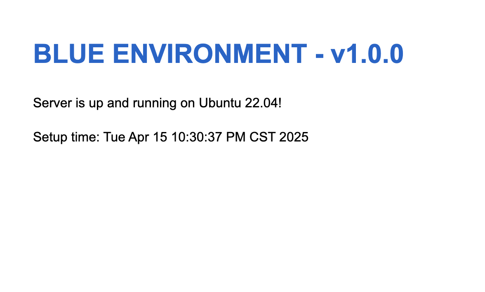
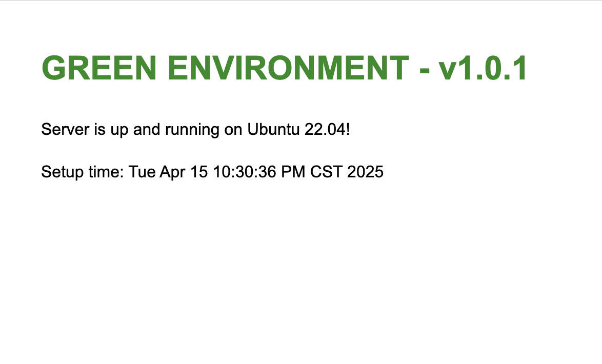

# BytePlus Blue/Green Deployment with Terraform

## Disclaimer
This project is for demonstration purposes and should be thoroughly reviewed and tested before using in production environments. You should work with your organisation’s security team to comply with the standards set if you are to deploy this solution in Production environment.

## Overview
This repository contains Terraform code for deploying BytePlus resources to enable a blue/green deployment strategy. The main resources deployed include VPC resources, an Autoscaling group, scaling configuration, scaling policy, and a CLB (Cloud Load Balancer). The code also includes user data scripts that create simple Nginx applications on the instances within the autoscaling groups. Two sets of application instances are created, labeled as 'blue' and 'green' resources, which simulate a blue/green deployment environment.

Customers can use this setup to perform blue-green deployments in the following steps:
1. 'Blue' resources represent the current version and are already deployed.
1. Deploy the new version of the application as the 'green' resources.
1. Use DNS weighted routing to route a percentage (e.g. 20%, then 50%) of the traffic to the new 'green' version.
1. Once everything is verified to be working correctly, route 100% of the traffic to the 'green' resources.
1. Delete the 'blue' resources.

## Main Terraform Resources
1. **VPC and Security Group**:
    - `byteplus_vpc.main`: The Virtual Private Cloud (VPC) where all resources are deployed.
    - `byteplus_security_group.app_sg`: A security group for the ECS instances with rules to allow ingress on ports 80 (HTTP) and 22 (SSH), and egress for all traffic.
2. **Autoscaling Group and Configuration**:
    - `byteplus_scaling_group.asg_blue` and `byteplus_scaling_group.asg_green`: Autoscaling groups for the 'blue' and 'green' environments respectively. Each group has a defined minimum, maximum, and desired number of instances, along with a cooldown period and instance termination policy.
    - `byteplus_scaling_configuration.scaling_config_blue` and `byteplus_scaling_configuration.scaling_config_green`: Configuration for the autoscaling groups, including the instance type, image ID, key pair, security group, EIP settings, and user data scripts.
3. **Scaling Policy**:
    - `byteplus_scaling_policy.asg_cpu_policy_blue` and `byteplus_scaling_policy.asg_cpu_policy_green`: CPU-based scaling policies that automatically adjust the capacity of the autoscaling groups based on the CPU utilization threshold.
4. **CLB and Listener**:
    - `byteplus_clb.app_clb_blue` and `byteplus_clb.app_clb_green`: Public Cloud Load Balancers for the 'blue' and 'green' environments.
    - `byteplus_listener.http_listener_blue` and `byteplus_listener.http_listener_green`: HTTP listeners for the CLBs with health check configurations.
5. **Server Group**:
    - `byteplus_server_group.app_server_group_blue` and `byteplus_server_group.app_server_group_green`: Server groups associated with the CLBs to manage the registered instances.

## User Data Scripts
1. **`userdata-blue.sh`**:
    - Updates the system packages on Ubuntu 22.04.
    - Installs Nginx and Git.
    - Creates an application directory `/var/www/app`.
    - Configures Nginx to serve from the application directory.
    - Creates a basic index.html file indicating it's the 'blue' environment with version v1.0.0.
    - Tests, enables, and restarts Nginx.
    - Adds a version identifier file `/var/www/app/version.txt`.
2. **`userdata-green.sh`**:
    - Similar to the `userdata-blue.sh` script, but creates an index.html file indicating it's the 'green' environment with version v1.0.1.

## Deployment Steps
1. **Pre-requisites**:
    - Install [Terraform](https://developer.hashicorp.com/terraform/install) on your local machine.
    - Prepare [BytePlus IAM User](https://docs.byteplus.com/en/docs/byteplus-platform/docs-creating-a-user) credentials with necessary permissions (access key and secret key).
    - Create an [ECS keypair](https://docs.byteplus.com/en/docs/ecs/Creating-key-pairs) on the BytePlus ECS console and note down the name.
    - Create a [BytePlus TOS (Torch Object Storage) bucket](https://docs.byteplus.com/en/docs/tos/docs-create-a-bucket) to store the Terraform state files.
2. **Set Credentials**:
    - Copy the provided `envvars-template.sh` file and rename it to `envvars.sh`.
    - Fill in the BytePlus IAM User credentials (access key and secret key) in the `envvars.sh` file.
    - Run `source envvars.sh` to set the environment variables.
3. **Configure Variables**:
    - Review and change any necessary variable values in the `variables.tf` file according to your requirements.
4. **Specify TOS Bucket**:
    - In `providers.tf`, specify the TOS bucket to remotely store the Terraform state files.
5. **Run Terraform Commands**:
    - Navigate to the directory containing the Terraform files in your terminal.
    - Run `terraform init` to initialize the Terraform working directory.
    - Run `terraform plan` to preview the changes that Terraform will make.
    - Run `terraform apply` and confirm the changes when prompted to deploy the resources.

## Post Deployment
Once the deployment is successful, you should see the following outputs:
```bash
Outputs:

blue_clb_public_ip = "101.47.31.198"
green_clb_public_ip = "101.47.30.90"
```

After several minutes, access both of the public IPs, e.g. http://101.47.31.198 and you should see both of the 'Blue' and 'Green' application versions.

| Blue | Green |
| ---- | ---- |
|  |  |

## Note
- Make sure to handle the DNS weighted routing configuration separately as it is not covered in this Terraform code.
- When performing a blue/green deployment, carefully monitor the application during the traffic migration to ensure a smooth transition.
- Clean up the resources properly after testing or when they are no longer needed by running `terraform destroy` to avoid unnecessary costs.